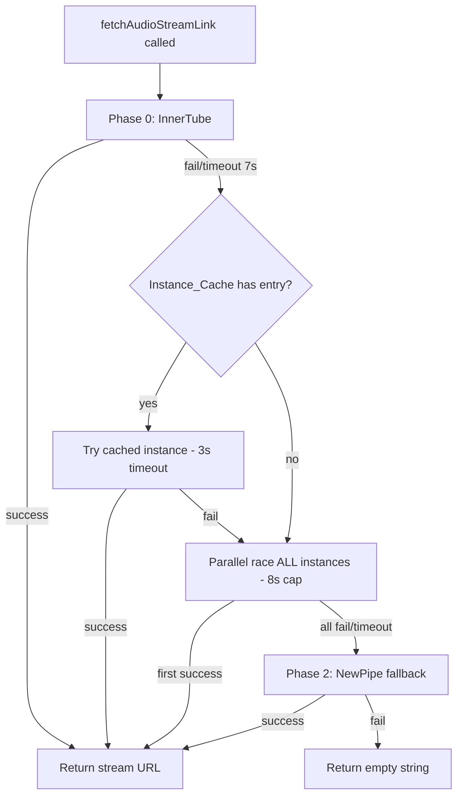
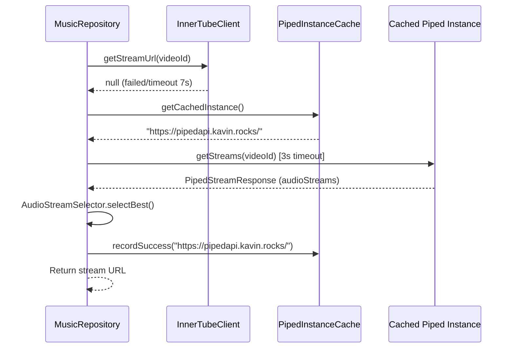
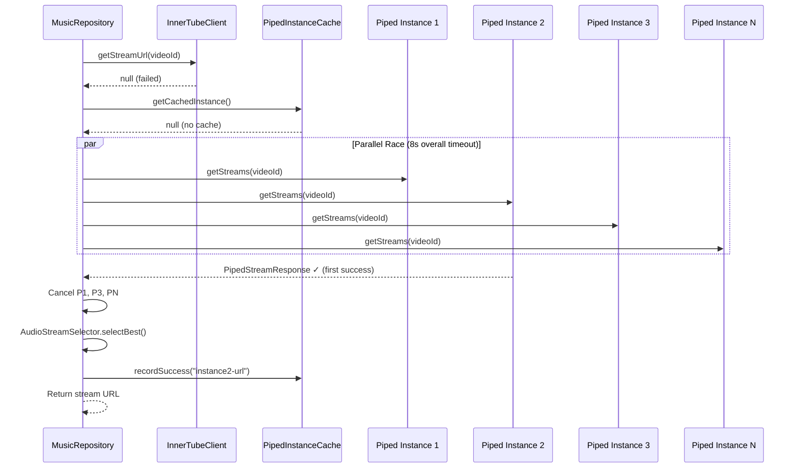
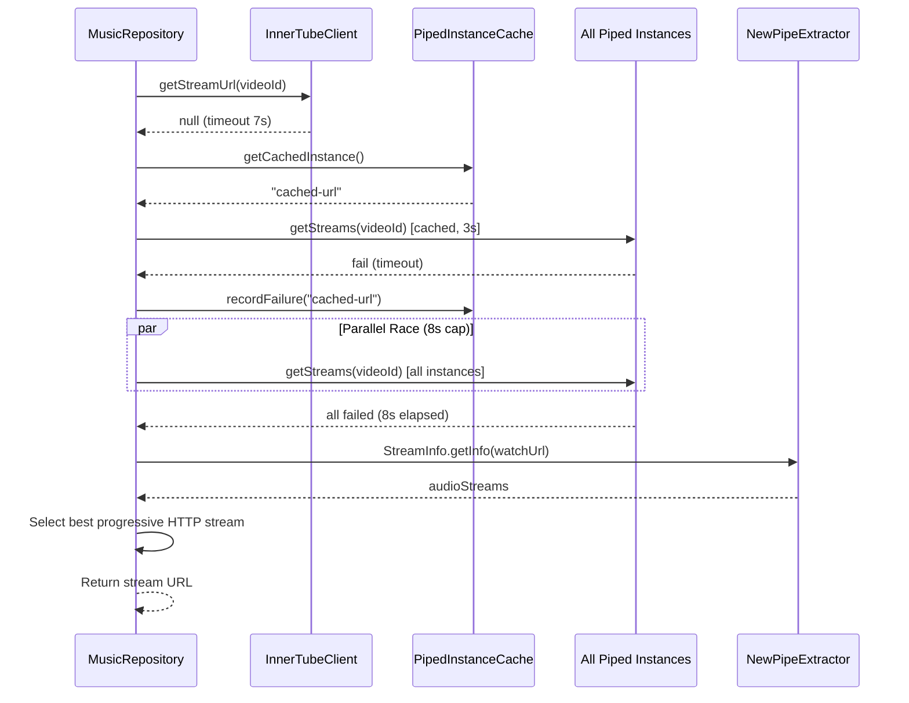

# Design Document: Fast Stream Resolution

## Overview

This design optimizes the Sonara audio stream resolution pipeline to dramatically reduce time-to-first-byte. The current implementation queries InnerTube (15s timeout), then iterates Piped instances sequentially (10s each × 8 instances = 80s worst case), then falls back to NewPipe — yielding a worst-case latency exceeding 90 seconds.

The optimized design introduces four performance improvements while preserving the existing InnerTube → Piped → NewPipe fallback order:

1. **Reduced InnerTube timeouts** — 5s connect / 7s read (down from 15s/15s)
2. **Parallel Piped race** — All instances queried concurrently via `async` + `select`, with 8s overall phase timeout
3. **Instance cache** — Remembers last-working Piped instance; tries it first with 3s timeout before the full race
4. **Connection pooling + preconnect** — Shared OkHttpClient with 8-connection pool and HEAD-based warm-up on app start

**Worst-case timeline comparison:**

| Scenario | Before | After |
|----------|--------|-------|
| InnerTube succeeds | ≤15s | ≤7s |
| InnerTube fails, cached Piped works | N/A | ≤10s |
| InnerTube fails, any Piped works | ≤95s | ≤15s |
| All methods fail | ≤95s+ | ≤25s |

## Architecture

The resolution pipeline remains a sequential chain of phases, but the Piped phase is restructured internally from sequential iteration to a cache-first + parallel-race pattern.



### Sequence Diagram: Cache Hit Flow



### Sequence Diagram: Cache Miss → Parallel Race



### Sequence Diagram: Full Fallback Chain



## Components and Interfaces

### Modified Components

#### 1. InnerTubeClient (modified)

**File:** `network/InnerTubeClient.kt`

Changes:
- Reduce `connectTimeout` from 15s to 5s
- Reduce `readTimeout` from 15s to 7s

```kotlin
object InnerTubeClient {
    private val client = OkHttpClient.Builder()
        .connectTimeout(5, TimeUnit.SECONDS)   // was 15
        .readTimeout(7, TimeUnit.SECONDS)      // was 15
        .build()
    // ... rest unchanged
}
```

#### 2. PipedClient (modified)

**File:** `network/PipedClient.kt`

Changes:
- Shared OkHttpClient with connection pool configuration
- Expose `preconnect()` function for warm-up
- Reduced per-instance timeouts (5s connect, 7s read)

```kotlin
object PipedClient {

    private val connectionPool = ConnectionPool(
        maxIdleConnections = 8,
        keepAliveDuration = 30,
        TimeUnit.SECONDS
    )

    private val okHttpClient = OkHttpClient.Builder()
        .connectionPool(connectionPool)
        .connectTimeout(5, TimeUnit.SECONDS)
        .readTimeout(7, TimeUnit.SECONDS)
        .addInterceptor(loggingInterceptor)
        .build()

    fun createService(baseUrl: String): PipedApiService {
        val url = if (baseUrl.endsWith("/")) baseUrl else "$baseUrl/"
        return Retrofit.Builder()
            .baseUrl(url)
            .client(okHttpClient)
            .addConverterFactory(GsonConverterFactory.create())
            .build()
            .create(PipedApiService::class.java)
    }

    /**
     * Preconnects to the given instances by issuing HEAD requests.
     * Warms up TCP+TLS connections in the shared pool.
     * Runs on Dispatchers.IO, does not throw.
     */
    suspend fun preconnect(instances: List<String>) {
        instances.forEach { baseUrl ->
            try {
                val request = okhttp3.Request.Builder()
                    .url(baseUrl)
                    .head()
                    .build()
                okHttpClient.newCall(request).execute().close()
            } catch (e: Exception) {
                android.util.Log.w("SONARA_NET", "Preconnect failed for $baseUrl: ${e.message}")
            }
        }
    }
}
```

#### 3. MusicRepository.fetchAudioStreamLink() (modified)

**File:** `data/MusicRepository.kt`

Major restructuring of the Piped resolution phase:
- Check Instance_Cache for last-working instance; try it with 3s timeout
- On cache miss/fail, launch parallel race across all instances with 8s cap
- Use `coroutineScope` + `async` + `select` for structured concurrency
- Record success/failure in cache

```kotlin
suspend fun fetchAudioStreamLink(videoId: String): String = withContext(Dispatchers.IO) {
    // Phase 0: InnerTube (5s connect / 7s read)
    val innerTubeUrl = tryInnerTube(videoId)
    if (!innerTubeUrl.isNullOrEmpty()) return@withContext innerTubeUrl

    // Phase 1: Piped (cache-first → parallel race)
    val pipedUrl = tryPipedWithCacheAndRace(videoId)
    if (!pipedUrl.isNullOrEmpty()) return@withContext pipedUrl

    // Phase 2: NewPipe fallback
    val newPipeUrl = tryNewPipe(videoId)
    if (!newPipeUrl.isNullOrEmpty()) return@withContext newPipeUrl

    "" // All methods failed
}
```

### New Components

#### 4. PipedInstanceCache (new)

**File:** `network/PipedInstanceCache.kt`

Thread-safe, in-memory cache for the last-working Piped instance.

```kotlin
object PipedInstanceCache {

    private val lock = Any()
    private var cachedInstance: String? = null
    private var consecutiveFailures: Int = 0

    fun getCachedInstance(): String? = synchronized(lock) {
        cachedInstance
    }

    fun recordSuccess(instance: String) = synchronized(lock) {
        cachedInstance = instance
        consecutiveFailures = 0
    }

    fun recordFailure(instance: String) = synchronized(lock) {
        if (cachedInstance == instance) {
            consecutiveFailures++
            if (consecutiveFailures >= 3) {
                cachedInstance = null
                consecutiveFailures = 0
            }
        }
    }

    /** Visible for testing */
    fun clear() = synchronized(lock) {
        cachedInstance = null
        consecutiveFailures = 0
    }
}
```

**Interface contract:**
- `getCachedInstance()`: Returns the cached base URL or null
- `recordSuccess(instance)`: Stores instance as cached, resets failure counter
- `recordFailure(instance)`: Increments failure counter; clears cache after 3 consecutive failures
- Thread-safe via `synchronized` (low contention — only called from IO dispatcher)

## Data Models

No new persistent data models are required. The feature operates entirely in-memory.

### In-Memory State

| Component | State | Type | Lifecycle |
|-----------|-------|------|-----------|
| PipedInstanceCache | `cachedInstance` | `String?` | App process lifetime |
| PipedInstanceCache | `consecutiveFailures` | `Int` | App process lifetime |
| PipedClient | `connectionPool` | `ConnectionPool` | Singleton (app lifetime) |

### Existing Models (unchanged)

- `PipedStreamResponse` — response from Piped `/streams/{videoId}`
- `PipedAudioStream` — individual stream entry with url, bitrate, mimeType, codec
- `InnerTubePlayerResponse` — response from YouTube player endpoint
- `AdaptiveFormat` — individual format from InnerTube response


## Correctness Properties

*A property is a characteristic or behavior that should hold true across all valid executions of a system — essentially, a formal statement about what the system should do. Properties serve as the bridge between human-readable specifications and machine-verifiable correctness guarantees.*

### Property 1: First successful instance wins the parallel race

*For any* set of Piped instances with arbitrary success/failure outcomes and response delays, the Stream_Resolver SHALL return the audio stream URL from the instance that succeeds first chronologically, and all other in-flight requests SHALL be cancelled.

**Validates: Requirements 2.2**

### Property 2: All defined failure modes are correctly classified

*For any* Piped instance response that is an HTTP error status (non-200), a network exception, a response with an empty `audioStreams` list, or a response where `AudioStreamSelector.selectBest()` returns null, the Stream_Resolver SHALL treat that instance as failed and not use its response as the resolution result.

**Validates: Requirements 2.3**

### Property 3: Cache state machine consistency

*For any* sequence of `recordSuccess(url)` and `recordFailure(url)` operations on the PipedInstanceCache:
- After `recordSuccess(url)`, `getCachedInstance()` returns `url` and the failure counter is 0
- After fewer than 3 consecutive `recordFailure(url)` calls (without an intervening success), `getCachedInstance()` still returns `url`
- After exactly 3 consecutive `recordFailure(url)` calls, `getCachedInstance()` returns null
- After any number of failures (< 3) followed by `recordSuccess(url)`, the failure counter resets to 0

**Validates: Requirements 3.1, 3.6, 3.7**

### Property 4: Resolution phases execute in strict order

*For any* video ID and any combination of phase outcomes (InnerTube success/fail, Piped success/fail, NewPipe success/fail), the Stream_Resolver SHALL attempt phases in the fixed order InnerTube → Piped → NewPipe, and SHALL NOT attempt a later phase if an earlier phase returned a valid (non-empty) stream URL.

**Validates: Requirements 5.1**

### Property 5: Total failure yields empty string without exception

*For any* video ID, when all resolution phases (InnerTube, Piped, NewPipe) fail to produce a non-empty stream URL, the Stream_Resolver SHALL return an empty string and SHALL NOT throw any exception to the caller.

**Validates: Requirements 5.2**

### Property 6: AudioStreamSelector always picks the optimal stream

*For any* non-empty list of valid audio streams (with non-empty URL, bitrate > 0, mimeType starting with "audio/"), `AudioStreamSelector.selectBest()` SHALL return the stream with the highest codec preference score (opus/webm=2, mp4/aac=1, other=0), and among streams with equal codec preference, the one with the highest bitrate.

**Validates: Requirements 5.4**

## Error Handling

### Phase-Level Error Isolation

Each resolution phase is wrapped in its own try-catch. Failures in one phase never prevent subsequent phases from executing.

| Phase | Error Types | Handling |
|-------|-------------|----------|
| InnerTube | SocketTimeoutException, IOException, HTTP non-200, parse error | Log warning, proceed to Piped phase |
| Piped (cached) | SocketTimeoutException (3s), IOException, HTTP non-200, empty streams | Record failure in cache, proceed to parallel race |
| Piped (race) | Individual instance: any exception, HTTP error, empty streams | Mark instance as failed in race; if all fail or 8s elapses, proceed to NewPipe |
| NewPipe | ExtractionException, IOException | Log error, return empty string |

### Coroutine Cancellation Safety

- All Piped race coroutines use `coroutineScope` for structured concurrency — if the scope is cancelled (e.g., user navigates away), all child coroutines are cancelled automatically
- `withTimeoutOrNull(8000)` wraps the race phase; on timeout, all children are cancelled via cooperative cancellation
- Individual instance requests respect cancellation because OkHttp's `Call` is cancellable by default when the coroutine is cancelled

### Cache Failure Escalation

```
Success → cache stores instance, counter = 0
Failure 1 → counter = 1, cache still valid
Failure 2 → counter = 2, cache still valid  
Failure 3 → cache cleared, counter = 0 (next resolution skips cache-first)
```

### Preconnect Error Handling

- HEAD requests during preconnect are fire-and-forget
- Each failed HEAD is logged individually but does not affect subsequent preconnects
- No error propagation to UI or app startup

## Testing Strategy

### Property-Based Tests (Kotlin + Kotest Property Testing)

The project will use **Kotest Property Testing** (`io.kotest:kotest-property`) for property-based tests. Each property test runs a minimum of **100 iterations** with randomly generated inputs.

| Property | Test Approach | Generator |
|----------|--------------|-----------|
| P1: First success wins | Generate random instance lists with random delays/outcomes; verify fastest success is returned | `Arb.list(Arb.pair(Arb.long(range), Arb.boolean()))` |
| P2: Failure mode classification | Generate random failure types (HTTP codes, exceptions, empty lists); verify all classified as failed | Custom `Arb` for failure scenarios |
| P3: Cache state machine | Generate random sequences of `recordSuccess`/`recordFailure` operations; verify state invariants | `Arb.list(Arb.element(Success, Failure))` |
| P4: Phase ordering | Generate random phase outcomes; verify ordering invariant via mock call ordering | `Arb.triple(Arb.boolean(), Arb.boolean(), Arb.boolean())` |
| P5: Total failure → empty | Generate random video IDs with all-fail mocks; verify "" and no exception | `Arb.string()` for video IDs |
| P6: Stream selector optimality | Generate random lists of `PipedAudioStream`; verify selected stream is optimal | Custom `Arb` for `PipedAudioStream` |

**Tag format:** Each property test includes a comment:
```kotlin
// Feature: fast-stream-resolution, Property 6: AudioStreamSelector always picks the optimal stream
```

### Unit Tests (Example-Based)

| Area | Test Cases |
|------|-----------|
| InnerTube timeout config | Verify 5s connect, 7s read on the OkHttpClient |
| Cache-first orchestration | Cache hit → early return; cache miss → parallel race |
| Preconnect | HEAD requests issued to first 3 instances; failures logged, not propagated |
| Overall timing | With mocked delays: InnerTube success < 7s, cached hit < 10s, race < 15s, total failure < 25s |
| Connection pool config | Verify 8 idle connections, 30s keep-alive |

### Integration Tests

| Scenario | Verification |
|----------|-------------|
| Real Piped instance reachability | Hit a known Piped instance, verify response shape |
| End-to-end resolution | Full pipeline with a known video ID, verify non-empty URL returned |
| Connection reuse | Multiple sequential resolutions reuse pooled connections (verify via EventListener) |

### Test Dependencies

```kotlin
testImplementation("io.kotest:kotest-property:5.8.0")
testImplementation("io.kotest:kotest-assertions-core:5.8.0")
testImplementation("io.mockk:mockk:1.13.9")
testImplementation("org.jetbrains.kotlinx:kotlinx-coroutines-test:1.7.3")
```
