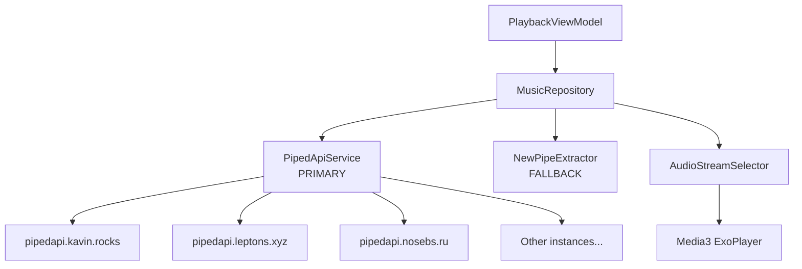
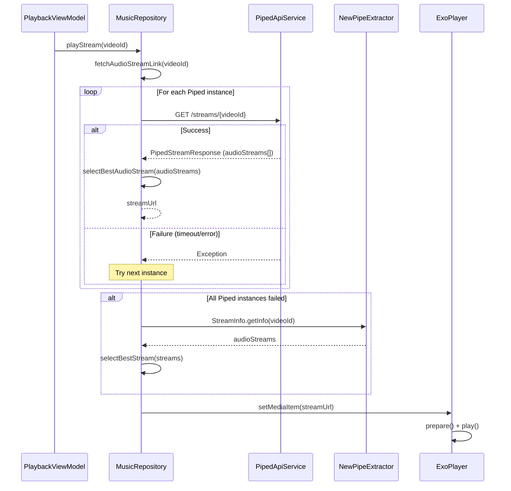

# Design Document: Fix Audio Stream Playback

## Overview

The Sonara Android music app's audio playback is broken because the stream URL extraction pipeline has multiple points of failure. NewPipeExtractor v0.24.4 fails to decipher YouTube's signature/throttling parameters (likely outdated against YouTube's rolling JS changes), the Cobalt API fallback endpoints are dead or rate-limited, and the Render.com backend fallback is unreliable.

The fix replaces the broken extraction pipeline with the **Piped API** approach — a free, open REST API that returns ready-to-play audio stream URLs (already deciphered and proxied). Multiple public Piped instances provide failover resilience. NewPipeExtractor is demoted to a last-resort fallback, and the dead Cobalt/Render code is removed entirely.

This approach mirrors what SimpMusic uses successfully for YouTube audio playback.

## Architecture



### Stream Resolution Flow



## Components and Interfaces

### Component 1: PipedApiService

**Purpose**: Retrofit interface for the Piped API that fetches stream metadata including direct audio URLs.

**Interface**:
```kotlin
interface PipedApiService {
    @GET("streams/{videoId}")
    suspend fun getStreams(@Path("videoId") videoId: String): PipedStreamResponse
}
```

**Responsibilities**:
- Define the HTTP contract for the Piped REST API
- Single endpoint: `GET /streams/{videoId}`
- Used with dynamic base URLs (one per Piped instance)

### Component 2: PipedModels

**Purpose**: Kotlin data classes representing the Piped API JSON response structure.

**Interface**:
```kotlin
data class PipedStreamResponse(
    val title: String?,
    val uploader: String?,
    val audioStreams: List<PipedAudioStream>
)

data class PipedAudioStream(
    val url: String,
    val bitrate: Int,
    val mimeType: String,
    val codec: String?,
    val format: String?,
    val quality: String?
)
```

**Responsibilities**:
- Map Piped API JSON to type-safe Kotlin objects
- Handle nullable fields gracefully (API may omit fields)

### Component 3: PipedClient (RetrofitClient extension)

**Purpose**: Factory for creating PipedApiService instances with dynamic base URLs.

**Interface**:
```kotlin
object PipedClient {
    fun createService(baseUrl: String): PipedApiService
}
```

**Responsibilities**:
- Reuse existing OkHttp client configuration (logging interceptor)
- Create Retrofit instances per Piped instance URL
- Apply appropriate timeouts for audio stream resolution (shorter than default)

### Component 4: AudioStreamSelector

**Purpose**: Logic to select the best audio stream from a list of candidates.

**Interface**:
```kotlin
object AudioStreamSelector {
    fun selectBest(streams: List<PipedAudioStream>): PipedAudioStream?
}
```

**Responsibilities**:
- Filter to audio-only streams (exclude video+audio muxed streams)
- Prefer opus/webm or m4a codecs (best quality-to-size for mobile)
- Sort by bitrate descending
- Return highest quality match, or null if no suitable stream found

### Component 5: MusicRepository (modified)

**Purpose**: Orchestrates the stream resolution with Piped-first, NewPipe-fallback strategy.

**Modified method**:
```kotlin
suspend fun fetchAudioStreamLink(videoId: String): String
```

**Responsibilities**:
- Iterate through Piped instances, trying each in order
- On success: extract best audio URL using AudioStreamSelector
- On all-Piped-failure: fall back to NewPipeExtractor
- Remove all Cobalt API and Render backend code
- Log each attempt for debugging

## Data Models

### PipedStreamResponse

```kotlin
data class PipedStreamResponse(
    val title: String?,
    val uploader: String?,
    val uploaderUrl: String?,
    val duration: Int?,
    val audioStreams: List<PipedAudioStream>
)
```

**Validation Rules**:
- `audioStreams` may be empty (video not available in region)
- Response is considered valid if HTTP 200 and JSON parses without exception

### PipedAudioStream

```kotlin
data class PipedAudioStream(
    val url: String,
    val bitrate: Int,
    val mimeType: String,   // e.g., "audio/webm", "audio/mp4"
    val codec: String?,     // e.g., "opus", "aac"
    val format: String?,    // e.g., "WEBMA_OPUS", "M4A"
    val quality: String?    // e.g., "128 kbps"
)
```

**Validation Rules**:
- `url` must be non-empty
- `bitrate` must be > 0 for a stream to be selectable
- `mimeType` must start with "audio/" for audio-only streams

## Algorithmic Pseudocode

### Stream Resolution Algorithm

```kotlin
suspend fun fetchAudioStreamLink(videoId: String): String {
    // Phase 1: Try all Piped instances
    for (instance in pipedInstances) {
        try {
            val service = PipedClient.createService(instance)
            val response = service.getStreams(videoId)
            val bestStream = AudioStreamSelector.selectBest(response.audioStreams)
            if (bestStream != null) {
                return bestStream.url
            }
        } catch (e: Exception) {
            Log.w(TAG, "Piped instance $instance failed: ${e.message}")
            continue
        }
    }

    // Phase 2: NewPipeExtractor fallback
    try {
        val streamInfo = StreamInfo.getInfo(ServiceList.YouTube, "https://www.youtube.com/watch?v=$videoId")
        val bestAudio = streamInfo.audioStreams
            .filter { it.isUrl && it.deliveryMethod == DeliveryMethod.PROGRESSIVE_HTTP }
            .maxByOrNull { it.averageBitrate }
        if (bestAudio?.content?.isNotEmpty() == true) {
            return bestAudio.content
        }
    } catch (e: Exception) {
        Log.e(TAG, "NewPipe fallback failed: ${e.message}")
    }

    return "" // Empty signals failure to caller
}
```

**Preconditions:**
- `videoId` is a non-empty, valid YouTube video ID (11 characters, alphanumeric + dash/underscore)
- Network connectivity is available
- At least one Piped instance URL is configured

**Postconditions:**
- Returns a non-empty URL string if any resolution method succeeds
- Returns empty string if all methods fail
- No exception is thrown to caller (all exceptions handled internally)

**Loop Invariants:**
- Each iteration tries exactly one Piped instance
- Failed instances are logged and skipped
- The instance list is not modified during iteration

### Audio Stream Selection Algorithm

```kotlin
fun selectBest(streams: List<PipedAudioStream>): PipedAudioStream? {
    // Step 1: Filter to audio-only streams with valid URLs
    val audioOnly = streams.filter { stream ->
        stream.url.isNotEmpty() &&
        stream.bitrate > 0 &&
        stream.mimeType.startsWith("audio/")
    }

    if (audioOnly.isEmpty()) return null

    // Step 2: Prefer opus/webm, then m4a/aac, then anything
    val preferred = audioOnly.sortedWith(
        compareByDescending<PipedAudioStream> { preferredCodecScore(it) }
            .thenByDescending { it.bitrate }
    )

    return preferred.firstOrNull()
}

private fun preferredCodecScore(stream: PipedAudioStream): Int {
    return when {
        stream.mimeType.contains("webm") || stream.codec?.contains("opus") == true -> 2
        stream.mimeType.contains("mp4") || stream.codec?.contains("aac") == true -> 1
        else -> 0
    }
}
```

**Preconditions:**
- `streams` is a non-null list (may be empty)

**Postconditions:**
- Returns the highest-quality audio-only stream, preferring opus > aac > other
- Returns null if no valid audio-only streams exist
- Does not mutate the input list

**Loop Invariants:**
- Sorting is stable: streams with equal codec preference are ordered by bitrate descending

## Key Functions with Formal Specifications

### Function 1: fetchAudioStreamLink()

```kotlin
suspend fun fetchAudioStreamLink(videoId: String): String
```

**Preconditions:**
- `videoId` is non-empty
- `pipedInstances` list contains at least one URL

**Postconditions:**
- If any Piped instance returns a valid response with audio streams, returns the URL of the best stream
- If all Piped instances fail but NewPipe succeeds, returns the NewPipe URL
- If all methods fail, returns empty string
- Never throws an exception

### Function 2: AudioStreamSelector.selectBest()

```kotlin
fun selectBest(streams: List<PipedAudioStream>): PipedAudioStream?
```

**Preconditions:**
- `streams` is non-null

**Postconditions:**
- If input is empty, returns null
- If input has valid audio streams, returns the one with highest codec preference + bitrate
- Never throws an exception

### Function 3: PipedClient.createService()

```kotlin
fun createService(baseUrl: String): PipedApiService
```

**Preconditions:**
- `baseUrl` is a valid HTTPS URL ending with `/`

**Postconditions:**
- Returns a ready-to-use PipedApiService Retrofit proxy
- Uses shared OkHttp client with 10-second connect/read timeouts

## Example Usage

```kotlin
// Example 1: Successful Piped resolution
val repo = MusicRepository(context)
val url = repo.fetchAudioStreamLink("dQw4w9WgXcQ")
// url = "https://pipedproxy-cdg.kavin.rocks/videoplayback?..."

// Example 2: Stream selection from Piped response
val streams = listOf(
    PipedAudioStream(url = "https://proxy/opus128", bitrate = 128000, mimeType = "audio/webm", codec = "opus", format = "WEBMA_OPUS", quality = "128 kbps"),
    PipedAudioStream(url = "https://proxy/aac256", bitrate = 256000, mimeType = "audio/mp4", codec = "aac", format = "M4A", quality = "256 kbps"),
    PipedAudioStream(url = "https://proxy/opus160", bitrate = 160000, mimeType = "audio/webm", codec = "opus", format = "WEBMA_OPUS", quality = "160 kbps"),
)
val best = AudioStreamSelector.selectBest(streams)
// best = PipedAudioStream(url="https://proxy/opus160", bitrate=160000, ...)
// Opus 160kbps wins over AAC 256kbps because codec preference (opus=2) > (aac=1)

// Example 3: Failover to NewPipe
// If all Piped instances return errors, NewPipeExtractor is tried as last resort
```

## Error Handling

### Error Scenario 1: Piped Instance Timeout/Unreachable

**Condition**: HTTP connection to a Piped instance times out or returns 5xx
**Response**: Log warning, move to next instance in the list
**Recovery**: Automatic — next instance is tried immediately

### Error Scenario 2: All Piped Instances Fail

**Condition**: Every Piped instance in the list returns an error or has no audio streams
**Response**: Fall back to NewPipeExtractor
**Recovery**: NewPipe attempts its own signature deciphering

### Error Scenario 3: Video Not Available

**Condition**: Piped returns 200 but `audioStreams` is empty (geo-blocked, removed, etc.)
**Response**: Treat as failure for that instance, try next
**Recovery**: Try all instances (different regions may have access), then NewPipe

### Error Scenario 4: All Methods Fail

**Condition**: Both Piped and NewPipe fail to resolve a stream URL
**Response**: Return empty string, caller logs error and does not start playback
**Recovery**: User can retry manually; no crash

### Error Scenario 5: Malformed Piped Response

**Condition**: JSON parsing fails (unexpected response format)
**Response**: Caught by try/catch, logged, instance skipped
**Recovery**: Next instance tried

## Testing Strategy

### Unit Testing Approach

- Test `AudioStreamSelector.selectBest()` with various stream combinations
- Test codec preference scoring logic
- Test empty list handling
- Test streams with invalid URLs or zero bitrate are filtered out
- Mock Piped API responses to test failover logic in `fetchAudioStreamLink()`

### Property-Based Testing Approach

- Generate random lists of `PipedAudioStream` objects and verify selection invariants hold
- Generate random instance lists and verify failover ordering is preserved

**Property Test Library**: Not applicable for initial Android integration — focus on unit tests with JUnit + MockK. Property tests can be added later with Kotest's property testing module if needed.

### Integration Testing Approach

- Manual smoke test: search for a song, tap play, verify audio output
- Test against live Piped instances in debug builds
- Verify ExoPlayer receives and plays the resolved URL

## Performance Considerations

- **Timeouts**: Set 10-second connect + read timeouts per Piped instance to avoid blocking the UI
- **Instance ordering**: Most reliable instances listed first (kavin.rocks is the official one)
- **No caching of service instances**: Retrofit services are lightweight; creating per-call with different base URLs is acceptable
- **Coroutine context**: All network calls on `Dispatchers.IO`, result delivered on Main

## Security Considerations

- All Piped instances use HTTPS — no plaintext HTTP
- No user credentials or API keys needed (Piped is public/free)
- Audio stream URLs are proxied through Piped — user's IP is not exposed to YouTube directly
- No sensitive data stored or logged (only video IDs and instance URLs in logs)

## Dependencies

- **Existing**: Retrofit 2.11, OkHttp 4.12, Gson, Media3 ExoPlayer, NewPipeExtractor v0.24.4
- **No new dependencies required** — Piped API uses the same Retrofit/Gson stack already in the project
- **Removed**: Cobalt API code, Render.com backend fallback code

## Correctness Properties

*A property is a characteristic or behavior that should hold true across all valid executions of a system — essentially, a formal statement about what the system should do. Properties serve as the bridge between human-readable specifications and machine-verifiable correctness guarantees.*

### Property 1: Deserialization Robustness

*For any* JSON response from the Piped API where optional fields (`codec`, `format`, `quality`) are missing or null, deserializing into PipedStreamResponse and PipedAudioStream SHALL NOT throw an exception, and the resulting objects SHALL have null for missing nullable fields and valid defaults for non-nullable fields.

**Validates: Requirement 2.3**

### Property 2: Valid Piped Response Yields Playable URL

*For any* PipedStreamResponse containing at least one audio stream with a non-empty URL, bitrate > 0, and mimeType starting with "audio/", the stream resolution SHALL return a non-empty URL string that is one of the URLs from the response's audioStreams list.

**Validates: Requirements 3.2, 5.1**

### Property 3: Instance Failover Exhaustion

*For any* list of N Piped instances where the first K instances (0 ≤ K < N) fail, the Stream_Resolver SHALL attempt exactly K+1 instances (trying each failed instance once and stopping at the first success), or attempt all N instances if all fail, before proceeding to the NewPipe fallback.

**Validates: Requirements 3.3, 3.5, 4.2**

### Property 4: Stream Filtering Validity

*For any* list of PipedAudioStream objects, the Audio_Stream_Selector SHALL only return a stream where `url` is non-empty, `bitrate` is greater than 0, and `mimeType` starts with "audio/". If no stream in the input meets all three criteria, the selector SHALL return null.

**Validates: Requirements 5.1, 5.4**

### Property 5: Stream Selection Preference Order

*For any* list of valid audio streams, the Audio_Stream_Selector SHALL return the stream with the highest codec preference score (opus/webm = 2, m4a/aac = 1, other = 0), and among streams with equal codec preference, SHALL return the one with the highest bitrate.

**Validates: Requirements 5.2, 5.3**

### Property 6: No Unhandled Exceptions

*For any* video ID string and any combination of network failures (timeouts, HTTP errors, malformed JSON, null responses) across all Piped instances and NewPipeExtractor, the `fetchAudioStreamLink()` function SHALL return a String value (empty or non-empty) without throwing any exception to its caller.

**Validates: Requirements 4.3, 6.4**
