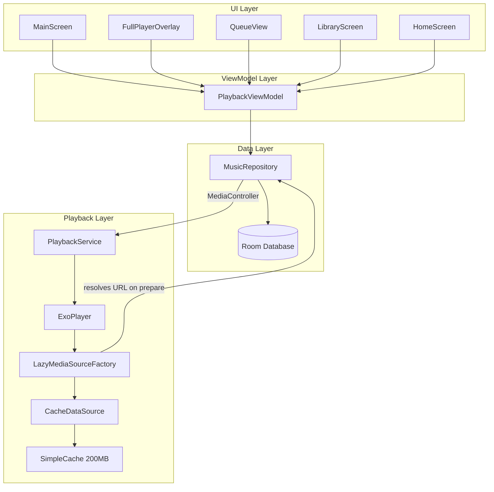

# Design Document: Playback Queue Controls

## Overview

This design adds a full playback queue system, repeat/shuffle controls, library management (liked songs, custom playlists, recent history), and improved search behavior to the Sonara Android music app. The architecture leverages ExoPlayer's native playlist capabilities via `setMediaItems()` rather than building a custom queue, Room database for persistence, Media3's `CacheDataSource` + `SimpleCache` for progressive audio caching, and lazy stream URL resolution to avoid eagerly resolving URLs for all queue items.

### Key Design Decisions

1. **ExoPlayer-native queue**: Use `setMediaItems()`, `addMediaItem()`, `moveMediaItem()` — no custom queue data structure. ExoPlayer manages playback order, shuffle, and repeat natively.
2. **Lazy stream resolution**: Queue items are loaded as `MediaItem` with only `mediaId` (video ID) and metadata. Stream URLs are resolved on-demand via a custom `MediaSource.Factory` when ExoPlayer prepares each item.
3. **Room database for persistence**: Liked songs, custom playlists, and recent history are stored in Room with reactive `Flow` queries.
4. **Progressive cache**: `SimpleCache` (200 MB LRU) + `CacheDataSource.Factory` enables instant seek within already-streamed portions.
5. **Debounced dynamic search**: 400ms debounce in ViewModel with coroutine Job cancellation for responsive search-as-you-type.

---

## Architecture



### Data Flow

1. **Search → Queue**: User taps a song in search results → `PlaybackViewModel` maps all visible results to `MediaItem` list (with videoId as mediaId, no stream URL yet) → `MusicRepository.setQueue(items, startIndex)` → MediaController calls `setMediaItems()` + `seekToDefaultPosition(startIndex)`.
2. **Lazy Resolution**: When ExoPlayer prepares a `MediaItem` for playback, `LazyMediaSourceFactory` intercepts, calls `MusicRepository.fetchAudioStreamLink(videoId)`, and returns a `ProgressiveMediaSource` backed by `CacheDataSource`.
3. **Persistence**: Like/unlike/playlist/recent operations go through `PlaybackViewModel` → `MusicRepository` → Room DAOs → SQLite.
4. **State Observation**: ExoPlayer state (repeat mode, shuffle mode, current item, queue) is observed via `Player.Listener` in `MusicRepository` and exposed as `StateFlow` to the ViewModel.

---

## Components and Interfaces

### 1. PlaybackViewModel (Enhanced)

```kotlin
class PlaybackViewModel(application: Application) : AndroidViewModel(application) {
    // Existing
    val isPlaying: StateFlow<Boolean>
    val currentMediaItem: StateFlow<MediaItem?>
    val currentPosition: StateFlow<Long>
    val duration: StateFlow<Long>
    val searchResults: StateFlow<List<YoutubeSearchItem>>

    // New — Queue & Modes
    val repeatMode: StateFlow<RepeatMode>       // OFF, ALL, ONE
    val shuffleEnabled: StateFlow<Boolean>
    val queueItems: StateFlow<List<QueueTrack>>
    val currentQueueIndex: StateFlow<Int>

    // New — Library
    val likedSongIds: StateFlow<Set<String>>    // video IDs of liked songs
    val customPlaylists: StateFlow<List<PlaylistEntity>>
    val recentSongs: StateFlow<List<RecentSongEntity>>

    // New — Search
    val searchPlaylists: StateFlow<List<SearchPlaylistItem>>
    private var searchJob: Job? = null

    // Actions
    fun playQueueFromSearch(results: List<YoutubeSearchItem>, startIndex: Int)
    fun toggleRepeatMode()
    fun toggleShuffle()
    fun addToQueue(item: YoutubeSearchItem)
    fun moveQueueItem(fromIndex: Int, toIndex: Int)
    fun toggleLike(videoId: String, title: String, artist: String, thumbnailUrl: String)
    fun isLiked(videoId: String): Boolean
    fun createPlaylist(name: String)
    fun addToPlaylist(playlistId: Long, song: SongEntity)
    fun playFromPlaylist(playlistId: Long, startIndex: Int)
    fun playFromRecent(startIndex: Int)
    fun performDebouncedSearch(query: String)
}
```

### 2. MusicRepository (Enhanced)

```kotlin
class MusicRepository(private val context: Context) {
    // Existing: mediaController, urlCache, fetchAudioStreamLink, etc.

    // New — Queue management
    fun setQueue(items: List<MediaItem>, startIndex: Int)
    fun addToQueue(item: MediaItem)
    fun moveQueueItem(fromIndex: Int, toIndex: Int)
    fun getQueueItems(): List<MediaItem>

    // New — Repeat/Shuffle
    fun setRepeatMode(mode: Int)   // Player.REPEAT_MODE_OFF/ALL/ONE
    fun setShuffleEnabled(enabled: Boolean)

    // New — State flows for queue observation
    val repeatMode: StateFlow<RepeatMode>
    val shuffleEnabled: StateFlow<Boolean>
    val queueItems: StateFlow<List<QueueTrack>>
    val currentQueueIndex: StateFlow<Int>

    // New — Persistence (delegates to DAOs)
    suspend fun likeSong(song: LikedSongEntity)
    suspend fun unlikeSong(videoId: String)
    suspend fun getLikedSongs(): Flow<List<LikedSongEntity>>
    suspend fun recordRecentPlay(song: RecentSongEntity)
    suspend fun getRecentSongs(): Flow<List<RecentSongEntity>>
    // ... playlist operations
}
```

### 3. PlaybackService (Enhanced)

```kotlin
class PlaybackService : MediaSessionService() {
    // Enhanced: ExoPlayer built with CacheDataSource + LazyMediaSourceFactory
    private lateinit var cache: SimpleCache
    private lateinit var cacheDataSourceFactory: CacheDataSource.Factory
    private lateinit var lazyMediaSourceFactory: LazyMediaSourceFactory
}
```

### 4. LazyMediaSourceFactory

```kotlin
@UnstableApi
class LazyMediaSourceFactory(
    private val cacheDataSourceFactory: CacheDataSource.Factory,
    private val urlResolver: suspend (videoId: String) -> String
) : MediaSource.Factory {
    override fun createMediaSource(mediaItem: MediaItem): MediaSource {
        // Returns a ProgressiveMediaSource that resolves the stream URL
        // on-demand via urlResolver(mediaItem.mediaId)
    }
}
```

### 5. Room Database Components

```kotlin
@Database(entities = [LikedSongEntity::class, PlaylistEntity::class, 
                      PlaylistSongEntity::class, RecentSongEntity::class], version = 1)
abstract class SonaraDatabase : RoomDatabase() {
    abstract fun likedSongDao(): LikedSongDao
    abstract fun playlistDao(): PlaylistDao
    abstract fun recentSongDao(): RecentSongDao
}
```

### 6. New UI Components

| Component | Purpose |
|-----------|---------|
| `QueueView` | Bottom sheet list showing upcoming tracks with drag-to-reorder |
| `LibraryScreen` | Tab showing Liked Songs, Recents, and Custom Playlists |
| `HomeScreen` | Tab showing up to 10 recent songs |
| `PlaylistDetailScreen` | Shows songs within a playlist |
| `RepeatButton` | Cycles OFF→ALL→ONE with visual indicators |
| `ShuffleButton` | Toggles shuffle with active/inactive styling |
| `LikeButton` | Heart icon, filled when liked |
| `AddToQueueButton` | Appends song to current queue |
| `AddToPlaylistSheet` | Bottom sheet for playlist selection |

---

## Data Models

### Room Entities

```kotlin
@Entity(tableName = "liked_songs")
data class LikedSongEntity(
    @PrimaryKey val videoId: String,
    val title: String,
    val artist: String,
    val thumbnailUrl: String,
    val likedAt: Long = System.currentTimeMillis()
)

@Entity(tableName = "playlists")
data class PlaylistEntity(
    @PrimaryKey(autoGenerate = true) val id: Long = 0,
    val name: String,
    val createdAt: Long = System.currentTimeMillis()
)

@Entity(
    tableName = "playlist_songs",
    primaryKeys = ["playlistId", "videoId"],
    foreignKeys = [ForeignKey(
        entity = PlaylistEntity::class,
        parentColumns = ["id"],
        childColumns = ["playlistId"],
        onDelete = ForeignKey.CASCADE
    )]
)
data class PlaylistSongEntity(
    val playlistId: Long,
    val videoId: String,
    val title: String,
    val artist: String,
    val thumbnailUrl: String,
    val addedAt: Long = System.currentTimeMillis(),
    val orderIndex: Int
)

@Entity(tableName = "recent_songs")
data class RecentSongEntity(
    @PrimaryKey val videoId: String,
    val title: String,
    val artist: String,
    val thumbnailUrl: String,
    val playedAt: Long = System.currentTimeMillis()
)
```

### DAOs

```kotlin
@Dao
interface LikedSongDao {
    @Query("SELECT * FROM liked_songs ORDER BY likedAt DESC")
    fun getAllLikedSongs(): Flow<List<LikedSongEntity>>

    @Query("SELECT videoId FROM liked_songs")
    fun getAllLikedIds(): Flow<List<String>>

    @Insert(onConflict = OnConflictStrategy.REPLACE)
    suspend fun insert(song: LikedSongEntity)

    @Query("DELETE FROM liked_songs WHERE videoId = :videoId")
    suspend fun delete(videoId: String)

    @Query("SELECT COUNT(*) FROM liked_songs")
    fun getCount(): Flow<Int>
}

@Dao
interface PlaylistDao {
    @Query("SELECT * FROM playlists ORDER BY createdAt DESC")
    fun getAllPlaylists(): Flow<List<PlaylistEntity>>

    @Insert
    suspend fun createPlaylist(playlist: PlaylistEntity): Long

    @Query("SELECT * FROM playlist_songs WHERE playlistId = :playlistId ORDER BY orderIndex ASC")
    fun getSongsForPlaylist(playlistId: Long): Flow<List<PlaylistSongEntity>>

    @Insert(onConflict = OnConflictStrategy.IGNORE)
    suspend fun addSongToPlaylist(song: PlaylistSongEntity): Long

    @Query("SELECT COUNT(*) FROM playlist_songs WHERE playlistId = :playlistId")
    fun getSongCount(playlistId: Long): Flow<Int>

    @Query("SELECT COUNT(*) FROM playlist_songs WHERE playlistId = :playlistId AND videoId = :videoId")
    suspend fun songExistsInPlaylist(playlistId: Long, videoId: String): Int
}

@Dao
interface RecentSongDao {
    @Query("SELECT * FROM recent_songs ORDER BY playedAt DESC LIMIT 50")
    fun getRecentSongs(): Flow<List<RecentSongEntity>>

    @Query("SELECT * FROM recent_songs ORDER BY playedAt DESC LIMIT 10")
    fun getRecentSongsForHome(): Flow<List<RecentSongEntity>>

    @Insert(onConflict = OnConflictStrategy.REPLACE)
    suspend fun upsert(song: RecentSongEntity)

    @Query("DELETE FROM recent_songs WHERE videoId NOT IN (SELECT videoId FROM recent_songs ORDER BY playedAt DESC LIMIT 50)")
    suspend fun trimToMax()
}
```

### UI State Models

```kotlin
enum class RepeatMode { OFF, ALL, ONE }

data class QueueTrack(
    val videoId: String,
    val title: String,
    val artist: String,
    val thumbnailUrl: String
)

data class SearchPlaylistItem(
    val playlistId: String,
    val title: String,
    val channelName: String,
    val thumbnailUrl: String,
    val videoCount: Int
)
```

---


## Correctness Properties

*A property is a characteristic or behavior that should hold true across all valid executions of a system — essentially, a formal statement about what the system should do. Properties serve as the bridge between human-readable specifications and machine-verifiable correctness guarantees.*

### Property 1: Queue population preserves items and start index

*For any* list of songs (from search results, a playlist, liked songs, or recents) and any valid tap index within that list, calling `setQueue(items, startIndex)` SHALL result in ExoPlayer holding exactly the same items in the same order, with playback starting at the tapped index.

**Validates: Requirements 1.1, 1.2, 9.9, 10.3, 11.6, 12.3, 14.5**

### Property 2: Repeat mode cycles deterministically

*For any* number of toggle presses N starting from OFF, the resulting repeat mode SHALL equal the value at position `N mod 3` in the cycle `[OFF, ALL, ONE]`.

**Validates: Requirements 2.2**

### Property 3: Shuffle toggle is a boolean flip

*For any* number of toggle presses N starting from disabled, the resulting shuffle state SHALL equal `N mod 2 != 0`.

**Validates: Requirements 3.2**

### Property 4: Add to queue appends to end

*For any* current queue of size N and any valid song, calling `addToQueue(song)` SHALL result in a queue of size N+1 where the last item's mediaId matches the added song's video ID, and all previous items remain in their original positions.

**Validates: Requirements 5.2**

### Property 5: Move queue item preserves all items

*For any* queue of size N (where N ≥ 2) and any valid fromIndex and toIndex (0 ≤ from, to < N), calling `moveQueueItem(from, to)` SHALL result in a queue of the same size N containing exactly the same set of items, with the item originally at fromIndex now at toIndex and all other items shifted accordingly.

**Validates: Requirements 6.7**

### Property 6: Like/unlike round trip

*For any* song not currently in the liked set, liking then unliking that song SHALL return the liked set to its original state (the song is not present). Conversely, for any song, liking it SHALL cause `isLiked(videoId)` to return true, and unliking it SHALL cause `isLiked(videoId)` to return false.

**Validates: Requirements 8.3, 8.4**

### Property 7: Playlist song addition is idempotent

*For any* playlist and any song, the first `addToPlaylist` call SHALL increase the playlist's song count by 1. Any subsequent `addToPlaylist` call with the same song and playlist SHALL leave the song count unchanged (no duplicates).

**Validates: Requirements 9.5, 9.6**

### Property 8: Recent play recording with upsert and cap

*For any* sequence of played tracks, recording each play SHALL maintain the following invariants: (a) the recent list never exceeds 50 entries, (b) no duplicate video IDs exist in the list, and (c) the most recently played song is always at index 0.

**Validates: Requirements 11.1, 11.2, 11.3**

### Property 9: Recent list is sorted by playedAt descending

*For any* set of recent song entries, the list returned by `getRecentSongs()` SHALL be sorted in strictly descending order of `playedAt` timestamp (most recent first).

**Validates: Requirements 11.5**

### Property 10: Home screen shows at most 10 recent songs

*For any* recent playlist of size M (where M ≥ 0), the home screen SHALL display exactly `min(M, 10)` songs, and those songs SHALL be the M most recently played ones.

**Validates: Requirements 12.1**

### Property 11: Queries shorter than 3 characters do not trigger search

*For any* string of length 0, 1, or 2, setting it as the search query SHALL NOT trigger a network search request and SHALL result in an empty search results list.

**Validates: Requirements 13.3**

### Property 12: Search playlist results are capped at 5

*For any* search query that returns K playlist results from the API (where K ≥ 0), the displayed playlist section SHALL show exactly `min(K, 5)` items.

**Validates: Requirements 14.6**

### Property 13: Failed stream resolution skips to next track

*For any* queue where a specific track's stream resolution fails (returns empty URL), the playback system SHALL advance to the next available track in the queue rather than stopping playback entirely.

**Validates: Requirements 15.2**

---

## Error Handling

| Scenario | Handling Strategy |
|----------|-------------------|
| Stream URL resolution fails for a queue item | Log error, skip to next track in queue. If all remaining tracks fail, stop playback. |
| Room database write fails (like/playlist/recent) | Catch exception, show toast to user, do not crash. Retry on next user action. |
| Network search fails (all Invidious instances) | Return empty results, show "No results found. Check network connection." message. |
| ExoPlayer playback error (buffering timeout, codec) | `Player.Listener.onPlayerError` catches it — log, show error toast, attempt to skip to next track. |
| Empty queue when user taps Add to Queue | Create new queue with single item, begin playback (graceful handling per Req 5.4). |
| Playlist name empty or whitespace | Reject creation, show validation message. |
| Duplicate song in playlist | Show "Already in playlist" message, no database write (idempotent per Req 9.6). |
| Cache directory inaccessible | Fall back to non-cached `DefaultDataSource.Factory`. Audio still plays, just without seek caching. |
| MediaController disconnects | `MusicRepository` re-initializes controller connection. Queue state may be lost — re-fetch from ExoPlayer on reconnect. |

---

## Testing Strategy

### Property-Based Tests (Kotest Property)

The project already includes `io.kotest:kotest-property:5.8.0` in test dependencies. Each property above will be implemented as a Kotest property test with minimum 100 iterations.

**Library**: Kotest Property (`io.kotest:kotest-property`)
**Configuration**: `checkAll(100)` minimum per property

Property tests will target the pure logic layer:
- `RepeatMode` cycling logic (Property 2)
- `ShuffleMode` toggle logic (Property 3)
- Queue manipulation functions: setQueue, addToQueue, moveQueueItem (Properties 1, 4, 5)
- Like/unlike state transitions (Property 6)
- Playlist add idempotence with in-memory DAO mock (Property 7)
- Recent play upsert + cap logic (Properties 8, 9)
- Home screen limit logic (Property 10)
- Search query length guard (Property 11)
- Playlist results cap (Property 12)
- Stream failure skip logic with mock resolver (Property 13)

**Tag format**: Each test will include a comment:
```kotlin
// Feature: playback-queue-controls, Property 2: Repeat mode cycles deterministically
```

### Unit Tests (JUnit + MockK)

Unit tests cover specific examples, integration points, and edge cases:
- Verify repeat mode maps correctly to ExoPlayer constants (3 cases)
- Verify shuffle boolean passes through to ExoPlayer
- Verify `playQueueFromSearch` correctly maps `YoutubeSearchItem` to `MediaItem`
- Verify debounce timing with `TestCoroutineScheduler`
- Verify job cancellation when query changes during in-flight search
- Verify empty state handling (empty queue, empty search, empty recents)
- Verify `LazyMediaSourceFactory` calls resolver only on prepare (not on queue set)

### Integration Tests (AndroidTest)

Integration tests verify ExoPlayer and Room behavior end-to-end:
- ExoPlayer repeat mode ALL loops queue
- ExoPlayer repeat mode ONE loops current track
- ExoPlayer shuffle produces different order than original
- seekToPrevious within 3s goes to previous track
- seekToPrevious after 3s seeks to beginning
- CacheDataSource serves cached data on seek-back
- Room DAO CRUD operations for liked songs, playlists, recents
- Full queue playback advancing through multiple tracks

### UI Tests (Compose Test)

- Repeat/shuffle button styling matches current mode
- Like button filled/outlined state matches liked status
- Queue view displays correct track list
- Drag-to-reorder gesture updates list
- Home screen shows recent songs or empty state message
- Search clears results when query is emptied
